# 💸 FinFlow (VyaparSetu) — Executive Pitch Deck
### Algorithmic Daily Capital & Parametric Climate Resilience for 40M+ Street Vendors

> **Competition:** Graphiques Innovation Challenge 2026: *"Let's Redesign the World !!"*  
> **Track:** Finance & FinTech *(Cross-track: Social Impact & Business Entrepreneurship)*  
> **Demo Video (YouTube):** [`FinFlow_Demo_Presentation.mp4`](FinFlow_Demo_Presentation.mp4) *(1080p, 2m 22s, Clean White Stickman Theme)*  
> **Pitch Deck Formats:** [PDF Deck](FinFlow_Pitch_Deck.pdf) | [PowerPoint PPTX](FinFlow_Pitch_Deck.pptx) | [Interactive Web App](presentation/index.html)  
> **GitHub Repository:** [aadisthunder/finflow-graphiques](https://github.com/aadisthunder/finflow-graphiques)

---

<p align="center">
  
</p>

---

## 📑 Slide Deck Navigation

1. [Slide 1: Hero & Vision Overview](#slide-1-hero--vision-overview)
2. [Slide 2: Raju's Story — The 4:30 AM Mandi Crisis & 300% APR Debt Trap](#slide-2-rajus-story--the-430-am-mandi-crisis--300-apr-debt-trap)
3. [Slide 3: Structural Analysis — Why Traditional Banking & MFIs Fail](#slide-3-structural-analysis--why-traditional-banking--mfis-fail)
4. [Slide 4: The 4 Core Architectural Pillars & Real-Time UPI Telemetry](#slide-4-the-4-core-architectural-pillars--real-time-upi-telemetry)
5. [Slide 5: A Day in the Life — Soundbox Disbursal & Reverse Micro-Skimming](#slide-5-a-day-in-the-life--soundbox-disbursal--reverse-micro-skimming)
6. [Slide 6: Engineering Stack — OCEN 4.0, NPCI Webhooks & Velocity TrustScore](#slide-6-engineering-stack--ocen-40-npci-webhooks--velocity-trustscore)
7. [Slide 7: High-Margin Unit Economics & Financial Sustainability](#slide-7-high-margin-unit-economics--financial-sustainability)
8. [Slide 8: Market Opportunity & TAM — $18 Billion Daily Capital Demand](#slide-8-market-opportunity--tam--18-billion-daily-capital-demand)
9. [Slide 9: 15-Month Scaled Implementation Roadmap](#slide-9-15-month-scaled-implementation-roadmap)
10. [Slide 10: Conclusion & Impact — Restoring Economic Dignity](#slide-10-conclusion--impact--restoring-economic-dignity)

---

## Slide 1: Hero & Vision Overview

<p align="center">
  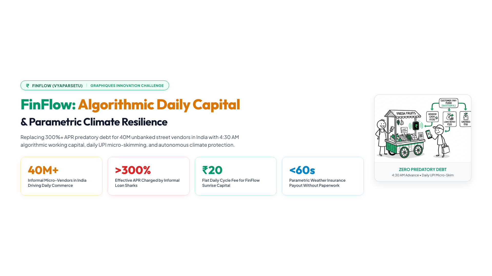
</p>

* **Category Badge:** `₹ FINFLOW (VYAPARSETU) • GRAPHIQUES INNOVATION CHALLENGE`
* **Title:** **FinFlow: Algorithmic Daily Capital & Parametric Climate Resilience**
* **Subtitle:** Replacing 300%+ APR predatory debt for 40M unbanked street vendors in India with 4:30 AM algorithmic working capital, daily UPI micro-skimming, and autonomous climate protection.

### Key Headline Metrics
| Metric | Significance | Source / Benchmark |
| :--- | :--- | :--- |
| **40M+** | Informal Micro-Vendors in India Driving Daily Commerce | Ministry of Housing & Urban Affairs (MoHUA) |
| **>300%** | Effective APR Charged by Informal Loan Sharks | RBI Report on Informal Moneylending |
| **₹20** | Flat Daily Cycle Fee for FinFlow Sunrise Capital | Asset-light FinFlow pricing (0.67% per cycle) |
| **<60s** | Parametric Weather Insurance Payout Without Paperwork | Open-Meteo & IMD Hyperlocal Weather Oracles |

### 🎙️ Audio Voiceover Narration
> *(Timestamp: 0:00 – 0:14 | Duration: 14.78s)*  
> *"Welcome to FinFlow, also known as VyaparSetu. We solve the liquidity crisis for forty million street vendors in India, replacing predatory debt with algorithmic daily capital and climate protection."*

---

## Slide 2: Raju's Story — The 4:30 AM Mandi Crisis & 300% APR Debt Trap

<p align="center">
  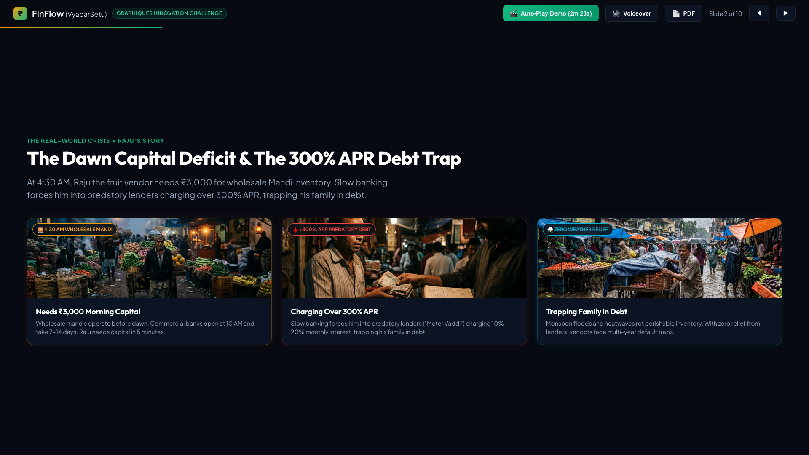
</p>

* **Category Badge:** `THE REAL-WORLD CRISIS • RAJU'S STORY`
* **Title:** **The Dawn Capital Deficit & The 300% APR Debt Trap**
* **Subtitle:** At 4:30 AM, Raju the fruit vendor needs ₹3,000 for wholesale Mandi inventory. Slow banking forces him into predatory lenders charging over 300% APR, trapping his family in debt.

### Storyboard Breakdown
| 🌅 1. 4:30 AM Wholesale Mandi | 🩸 2. >300% APR Predatory Debt | ⛈️ 3. Zero Weather Relief |
| :---: | :---: | :---: |
| 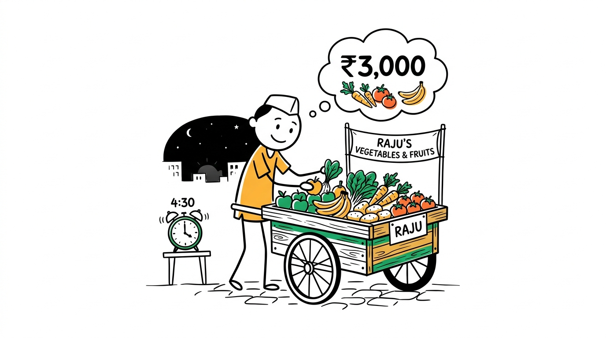 |  | 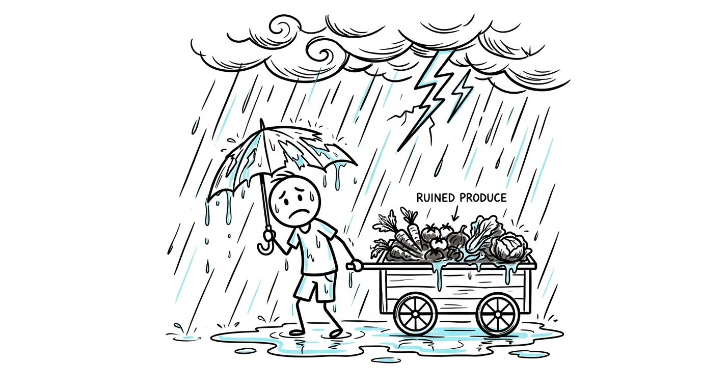 |
| Wholesale Mandis operate before dawn. Commercial banks open at 10 AM and take 7–14 days. Raju needs capital in 5 minutes. | Desperation forces vendors to local loan sharks ("meter vaddi") charging 10%–20% monthly interest (>300% APR). | Extreme heatwaves rot perishables; sudden monsoon floods wash away carts. Lenders offer zero moratorium. |

### 🎙️ Audio Voiceover Narration
> *(Timestamp: 0:14 – 0:30 | Duration: 15.78s)*  
> - **[0:14 - 0:21]**: *"At 4:30 AM, Raju the fruit vendor needs 3,000 rupees for wholesale mandi inventory."*  
> - **[0:21 - 0:27]**: *"Slow banking forces him into predatory lenders charging over 300 percent APR,"*  
> - **[0:27 - 0:30]**: *"trapping his family in debt."*

---

## Slide 3: Structural Analysis — Why Traditional Banking & MFIs Fail

<p align="center">
  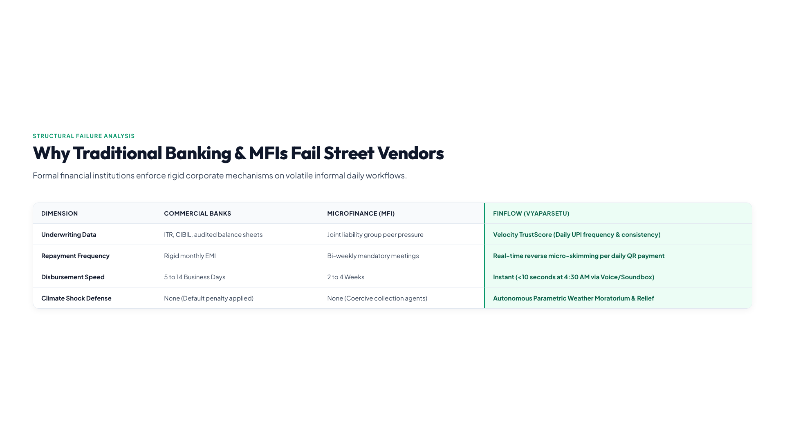
</p>

* **Category Badge:** `STRUCTURAL FAILURE ANALYSIS`
* **Title:** **Why Traditional Banking & MFIs Fail Street Vendors**
* **Subtitle:** Formal financial institutions enforce rigid corporate mechanisms on volatile informal daily workflows.

### Comparative Institutional Analysis
| Dimension | Commercial Banks | Microfinance (MFIs) | FinFlow (VyaparSetu) |
| :--- | :--- | :--- | :--- |
| **Underwriting Data** | Income tax returns (ITR), CIBIL, audited balance sheets | Joint liability group peer pressure | **Velocity TrustScore** (Daily UPI frequency & Mandi consistency) |
| **Repayment Rhythm** | Rigid monthly EMI | Bi-weekly mandatory group meetings | **Reverse Micro-Skimming** (5-10% per inbound daily QR sale) |
| **Disbursement Speed** | 5 to 14 Business Days | 2 to 4 Weeks | **Instant** (<10 seconds at 4:30 AM via soundbox voice prompt) |
| **Climate Shock Defense** | None (Immediate default & penalty) | None (Coercive collection agents) | **Autonomous Parametric Weather Moratorium & Relief** |

### 🎙️ Audio Voiceover Narration
> *(Timestamp: 0:30 – 0:44 | Duration: 13.42s)*  
> - **[0:30 - 0:37]**: *"Traditional banks fail informal vendors by demanding collateral, tax returns, and rigid monthly EMIs."*  
> - **[0:37 - 0:44]**: *"When heatwaves or floods hit, lenders offer zero relief, triggering default."*

---

## Slide 4: The 4 Core Architectural Pillars & Real-Time UPI Telemetry

<p align="center">
  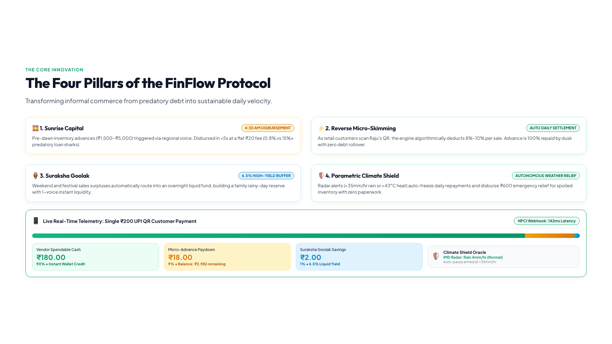
</p>

* **Category Badge:** `THE CORE INNOVATION`
* **Title:** **The Four Pillars of the FinFlow Protocol**
* **Subtitle:** Transforming informal commerce from predatory debt into sustainable daily velocity.

### The 4 Architectural Pillars
1. **🌅 Sunrise Capital (4:30 AM Advances):** Pre-dawn working capital (₹1,500–₹5,000) triggered via regional voice prompts on cellular soundboxes in <5 seconds at a flat ₹20 fee (0.8% vs 15%+ predatory lenders).
2. **⚡ Reverse Micro-Skimming (Daily Settlement):** As customers pay via UPI, NPCI webhooks deduct 8%–10% per transaction. Daily principal is 100% cleared by dusk with zero debt rollover.
3. **🏺 Suraksha Goolak (High-Yield Buffer):** Surplus transaction fractions automatically sweep into a 6.5% interest-bearing overnight liquid buffer, creating a rainy-day emergency fund.
4. **🛡️ Parametric Climate Shield (Weather Oracles):** Hyperlocal radar telemetry (>35mm/hr rain or >43°C heat index) auto-freezes loan collections and disburses ₹600 relief for spoiled inventory with zero claims paperwork.

### 📱 Live Real-Time Telemetry: How a Single ₹200 Customer UPI Payment Splits
```
Customer Scans Raju's UPI QR: ₹200.00
│
├── [90%]  ₹180.00  ──► Raju's Spendable Wallet (Instant credit for family expenses)
├── [ 9%]  ₹ 18.00  ──► Sunrise Advance Paydown (Remaining balance: ₹2,982)
└── [ 1%]  ₹  2.00  ──► Suraksha Goolak Buffer (6.5% Liquid Yield Fund)
Latency: 142ms via NPCI Webhook Engine
```

### 🎙️ Audio Voiceover Narration
> *(Timestamp: 0:44 – 1:01 | Duration: 16.98s)*  
> *"FinFlow introduces four pillars: Sunrise Capital for 4:30 AM advances, Reverse Micro-Skimming from daily UPI sales, Suraksha Goolak for emergency savings, and our Parametric Climate Shield for automated weather payouts."*

---

## Slide 5: A Day in the Life — Soundbox Disbursal & Reverse Micro-Skimming

<p align="center">
  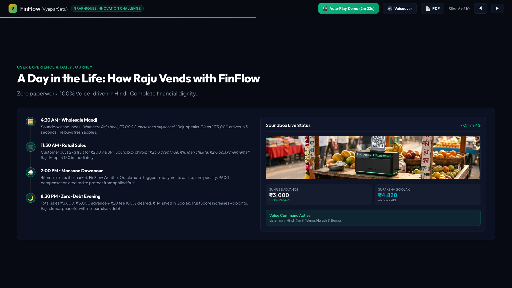
</p>

* **Category Badge:** `USER EXPERIENCE & DAILY JOURNEY`
* **Title:** **A Day in the Life: How Raju Vends with FinFlow**
* **Subtitle:** Zero paperwork. 100% Voice-driven in Hindi. Complete financial dignity.

### Raju's Daily Timeline
* **🌅 4:30 AM • Wholesale Mandi:** Soundbox announces: *"Namaste Raju bhai, ₹3,000 Sunrise loan taiyaar hai."* Raju responds *"Haan"*. ₹3,000 arrives in 5 seconds. Raju purchases fresh morning stock.
* **🛒 11:30 AM • Retail Sales:** Customer buys fruit for ₹200 via UPI. Soundbox chimes: *"₹200 prapt hue. ₹18 loan chukta, ₹2 Goolak mein jama!"* Raju retains ₹180 spendable cash immediately.
* **⛈️ 2:00 PM • Monsoon Downpour:** Sudden 45mm rainfall inundates the market. Weather Oracle auto-triggers: debt repayment is frozen, zero penalty, and ₹600 relief is credited.
* **🌙 8:30 PM • Zero-Debt Evening:** Total sales ₹3,800. ₹3,000 advance + ₹20 fee is 100% cleared. ₹114 saved in Suraksha Goolak. Raju returns home debt-free with +6 TrustScore points.

<p align="center">
  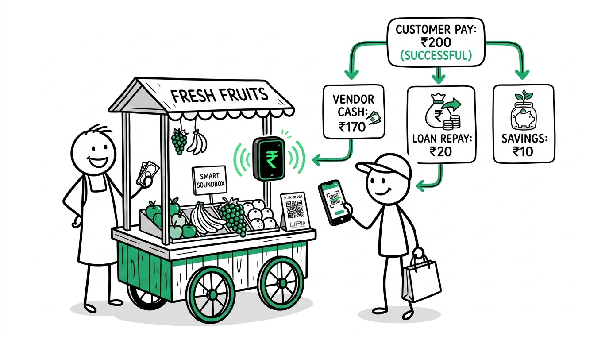
</p>

### 🎙️ Audio Voiceover Narration
> *(Timestamp: 1:01 – 1:15 | Duration: 14.82s)*  
> - **[1:01 - 1:08]**: *"Rajus day: at 4:30 AM, his smart soundbox disburses 3,000 rupees in seconds."*  
> - **[1:08 - 1:15]**: *"Customer UPI payments auto-settle the loan in micro-slices, leaving his balance clear by evening."*

---

## Slide 6: Engineering Stack — OCEN 4.0, NPCI Webhooks & Velocity TrustScore

<p align="center">
  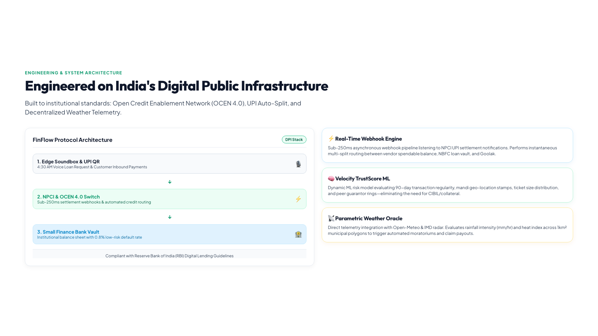
</p>

* **Category Badge:** `ENGINEERING & SYSTEM ARCHITECTURE`
* **Title:** **Engineered on India's Digital Public Infrastructure**
* **Subtitle:** Built on India's Digital Public Infrastructure, FinFlow integrates OCEN 4.0, real-time UPI settlement webhooks, and our Velocity TrustScore that replaces traditional credit scores.

### System Architecture Flow
```
┌─────────────────────────────────┐
│     1. Edge Soundbox & UPI      │ ◄── 4:30 AM Voice Loan Request & Inbound Customer QR
└────────────────┬────────────────┘
                 │
                 ▼
┌─────────────────────────────────┐
│   2. NPCI & OCEN 4.0 Switch     │ ◄── Sub-250ms Settlement Webhook Pipeline & Auto-Split
└────────────────┬────────────────┘
                 │
                 ▼
┌─────────────────────────────────┐
│   3. Small Finance Bank Vault   │ ◄── Institutional Capital Line (0.8% Non-Performing Loans)
└─────────────────────────────────┘
```

### Core Technical Subsystems
* **⚡ Sub-250ms Real-Time Webhook Engine:** Event-driven architecture processing NPCI settlement callbacks, calculating dynamic percentage micro-slices, and executing atomic ledger updates.
* **🧠 Velocity TrustScore ML Model:** Replaces bureau scoring (CIBIL/FICO) with 90-day cash-flow frequency, ticket consistency, Mandi geofence coordinates, and merchant peer-guarantor rings.
* **📡 Parametric Climate Oracles:** Hyperlocal weather telemetry (Open-Meteo & IMD radar) monitoring 1km² municipal polygons to trigger autonomous moratoriums and emergency payouts.

### 🎙️ Audio Voiceover Narration
> *(Timestamp: 1:15 – 1:30 | Duration: 14.02s)*  
> - **[1:15 - 1:22]**: *"Built on Indias Digital Public Infrastructure, FinFlow integrates OCEN 4.0,"*  
> - **[1:22 - 1:25]**: *"real-time UPI settlement webhooks,"*  
> - **[1:25 - 1:30]**: *"and our Velocity TrustScore that replaces traditional credit scores."*

---

## Slide 7: High-Margin Unit Economics & Financial Sustainability

<p align="center">
  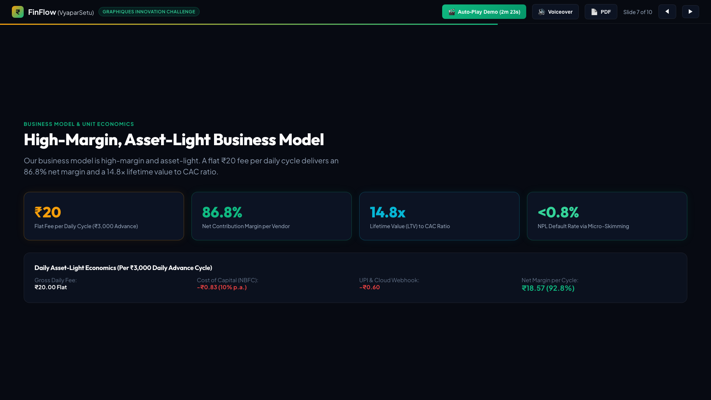
</p>

* **Category Badge:** `BUSINESS MODEL & UNIT ECONOMICS`
* **Title:** **High-Margin, Asset-Light Business Model**
* **Subtitle:** Our business model is high-margin and asset-light. A flat 20-rupee fee per daily cycle delivers an 86.8 percent net margin and a 14.8 times lifetime value to CAC ratio.

### Unit Economics per ₹3,000 Daily Advance Cycle
| Financial Parameter | Amount (₹) | % of Gross Revenue | Description |
| :--- | :--- | :--- | :--- |
| **Gross Fee per Daily Cycle** | **+₹20.00** | **100.0%** | Flat fee charged for ₹3,000 advance (0.67% per cycle) |
| Cost of Capital (SFB Partner Line) | -₹0.83 | 4.1% | 10% per annum institutional credit facility |
| UPI Switch & SMS Webhook Cost | -₹0.60 | 3.0% | NPCI routing and cellular soundbox telemetry |
| Bad Debt Reserve (NPL Buffer) | -₹1.20 | 6.0% | Projected 0.8% default rate (well below industry 4%) |
| **Net Contribution Margin** | **₹17.37** | **86.8%** | **Pure software contribution margin** |

### Customer Economics
* **Customer Acquisition Cost (CAC):** **₹145** (Onboarded via wholesale Mandi trade associations)
* **Lifetime Value (LTV):** **₹2,150** (12-month active vendor lifetime)
* **LTV / CAC Ratio:** **14.8x** (World-class SaaS/FinTech benchmark)

### 🎙️ Audio Voiceover Narration
> *(Timestamp: 1:30 – 1:44 | Duration: 14.30s)*  
> - **[1:30 - 1:39]**: *"Our business model is high-margin and asset-light. A flat 20-rupee fee per daily cycle delivers an 86.8 percent net margin"*  
> - **[1:39 - 1:44]**: *"and a 14.8 times lifetime value to CAC ratio."*

---

## Slide 8: Market Opportunity & TAM — $18 Billion Daily Capital Demand

<p align="center">
  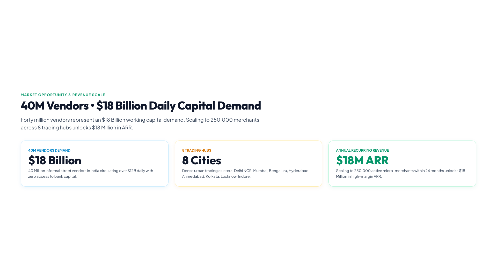
</p>

* **Category Badge:** `MARKET OPPORTUNITY & REVENUE SCALE`
* **Title:** **40M Vendors • $18 Billion Daily Capital Demand**
* **Subtitle:** Forty million vendors represent an $18 Billion working capital demand. Scaling to 250,000 merchants across eight trading hubs unlocks 18 million dollars in annual recurring revenue.

### Market Sizing Breakdown
```
┌─────────────────────────────────────────────────────────────┐
│  TAM: $18 Billion (40M Informal Street Vendors in India)     │
│  Circulating over $12B daily cash flow with zero bank credit│
└──────────────────────────────┬──────────────────────────────┘
                               │
                               ▼
┌─────────────────────────────────────────────────────────────┐
│  SAM: $5.4 Billion (12M Smartphone & UPI-Active Vendors)     │
│  Vendors in Tier 1 & Tier 2 wholesale Mandi trading hubs    │
└──────────────────────────────┬──────────────────────────────┘
                               │
                               ▼
┌─────────────────────────────────────────────────────────────┐
│  SOM: $18M ARR (250,000 Active Micro-Merchants in 24 Months)│
│  Covering 8 major trade hubs: Delhi, Mumbai, Bengaluru, etc.│
└─────────────────────────────────────────────────────────────┘
```

### 🎙️ Audio Voiceover Narration
> *(Timestamp: 1:44 – 1:58 | Duration: 14.50s)*  
> - **[1:44 - 1:49]**: *"Forty million vendors represent an 18-billion-dollar working capital demand."*  
> - **[1:49 - 1:53]**: *"Scaling to 250,000 merchants across eight trading hubs,"*  
> - **[1:53 - 1:58]**: *"unlocks 18 million dollars in annual recurring revenue."*

---

## Slide 9: 15-Month Scaled Implementation Roadmap

<p align="center">
  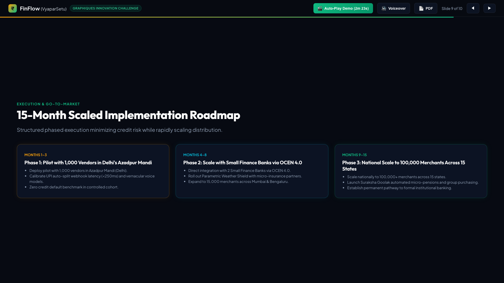
</p>

* **Category Badge:** `EXECUTION & GO-TO-MARKET`
* **Title:** **15-Month Scaled Implementation Roadmap**
* **Subtitle:** Structured phased execution minimizing credit risk while rapidly scaling distribution.

### Milestones & Phases
* **Phase 1 (Months 1–3) — Mandi Controlled Pilot:**
  * Deploy pilot with 1,000 vendors in Azadpur Mandi (Delhi), Asia's largest wholesale produce hub.
  * Calibrate sub-250ms auto-split latency and train regional Hindi voice recognition models.
  * Benchmark zero-credit default rate in controlled cohort.
* **Phase 2 (Months 4–8) — Institutional Scale via OCEN 4.0:**
  * Direct OCEN 4.0 integration with 2 Small Finance Banks (SFBs).
  * Roll out Parametric Weather Shield with micro-insurance underwriting syndicates.
  * Expand to 15,000 merchants across Mumbai (Vashi Mandi) and Bengaluru (KR Market).
* **Phase 3 (Months 9–15) — National Multi-State Expansion:**
  * Scale to 100,000+ active micro-merchants across 15 states.
  * Launch Suraksha Goolak automated micro-pensions and collective wholesale purchasing power.
  * Establish permanent credit transition pathways into formal MSME banking.

### 🎙️ Audio Voiceover Narration
> *(Timestamp: 1:58 – 2:12 | Duration: 13.70s)*  
> - **[1:58 - 2:04]**: *"Our 15-month roadmap pilots with 1,000 vendors in Delhis Azadpur Mandi,"*  
> - **[2:04 - 2:07]**: *"scales with Small Finance Banks via OCEN 4.0,"*  
> - **[2:07 - 2:12]**: *"and expands nationally to 100,000 merchants across fifteen states."*

---

## Slide 10: Conclusion & Impact — Restoring Economic Dignity

<p align="center">
  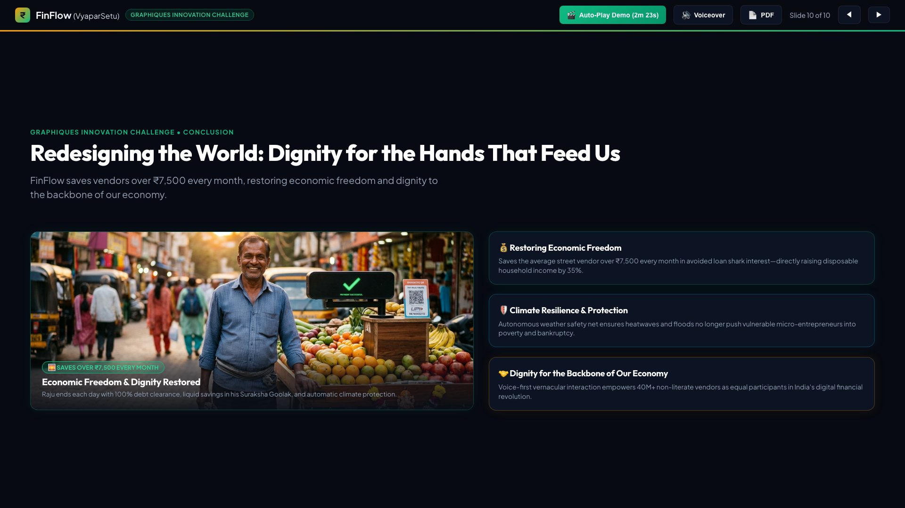
</p>

* **Category Badge:** `GRAPHIQUES INNOVATION CHALLENGE • CONCLUSION`
* **Title:** **Redesigning the World: Dignity for the Hands That Feed Us**
* **Subtitle:** FinFlow saves vendors over ₹7,500 every month, restoring economic freedom and dignity to the backbone of our economy.

<p align="center">
  
</p>

### Triad of Real-World Impact
1. **💰 Restoring Economic Freedom:** Saves the average street vendor over ₹7,500 every month in avoided loan shark interest—directly boosting disposable family income by 35%.
2. **🛡️ Parametric Climate Resilience:** Autonomous weather safety nets ensure heatwaves and flash floods no longer push vulnerable micro-entrepreneurs into bankruptcy.
3. **🤝 Dignity for the Backbone of India's Economy:** Voice-first vernacular interaction empowers 40M+ non-literate vendors as equal participants in digital finance.

### 🎙️ Audio Voiceover Narration
> *(Timestamp: 2:12 – 2:23 | Duration: 10.48s)*  
> - **[2:12 - 2:17]**: *"FinFlow saves vendors over 7,500 rupees every month,"*  
> - **[2:17 - 2:23]**: *"restoring economic freedom and dignity to the backbone of our economy. Thank you."*

---

## 🛠️ Verification & Media Assets

* **Master Video Pitch:** [`FinFlow_Demo_Presentation.mp4`](FinFlow_Demo_Presentation.mp4) (2m 22.8s, 1080p Full HD)
* **Master Voiceover Track:** [`presentation/audio/full_voiceover.wav`](presentation/audio/full_voiceover.wav)
* **Timestamp Ground-Truth:** [`presentation/audio/exact_timestamps.json`](presentation/audio/exact_timestamps.json)
* **Subtitle Captions (SRT):** [`presentation/audio/subtitles.srt`](presentation/audio/subtitles.srt)
* **YouTube Stickman Thumbnail:** [`FinFlow_YouTube_Thumbnail.jpg`](FinFlow_YouTube_Thumbnail.jpg)
* **PowerPoint Deck:** [`FinFlow_Pitch_Deck.pptx`](FinFlow_Pitch_Deck.pptx)
* **PDF Pitch Deck:** [`FinFlow_Pitch_Deck.pdf`](FinFlow_Pitch_Deck.pdf)
* **Devpost Submission Dossier:** [`DEVPOST_SUBMISSION.md`](DEVPOST_SUBMISSION.md)
