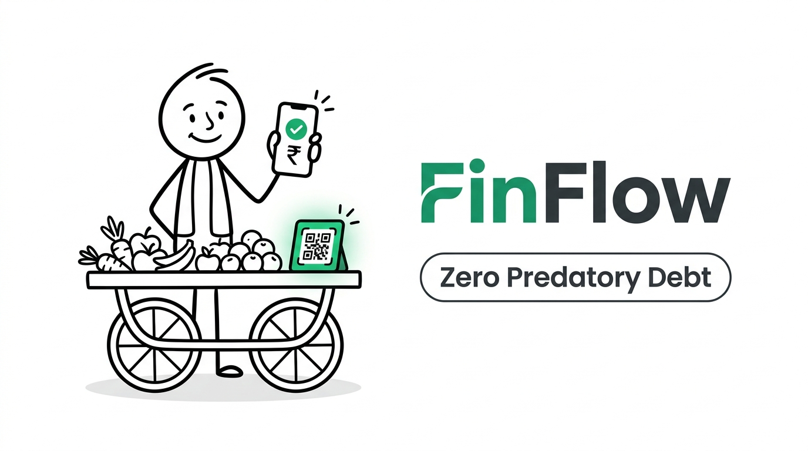

# 💸 FinFlow (VyaparSetu)
### Algorithmic Daily Capital & Parametric Climate Resilience for 40M+ Street Vendors

[](https://devpost.com/)
[](https://devpost.com/)
[](https://www.npci.org.in/)
[](LICENSE)

---

<p align="center">
  
</p>

---

## 📌 Executive Summary

Every morning at **4:30 AM**, over **40 million informal street vendors** across India face an invisible liquidity barrier: they require **₹1,500 to ₹5,000** in immediate cash to purchase perishable goods at wholesale Mandis before dawn. 

Because traditional commercial banks require collateral, tax returns (ITR), and 7–14 days of underwriting, over **85% of vendors are forced into predatory daily debt** ("meter vaddi"), paying interest rates that compound to **over 300% effective APR**. When extreme monsoon floods or heatwaves hit, vendors absorb 100% of losses, leading to catastrophic default.

**FinFlow (VyaparSetu)** redesigns informal microfinance by aligning credit with the **natural daily heartbeat of informal commerce**. Operating over India's Digital Public Infrastructure (DPI) and smart soundboxes, FinFlow provides:
1. **Sunrise Capital:** Automated 4:30 AM inventory advances disbursed in <60 seconds at a flat ₹20 daily fee.
2. **Reverse Micro-Skimming:** Painless daily loan recovery via 5–10% automatic deductions from incoming customer UPI payments.
3. **Suraksha Goolak:** Automated micro-savings accrued on top of daily settlements to build resilience.
4. **Parametric Climate Shield:** Instant weather insurance triggered autonomously by hyper-local climate APIs (>44°C heatwaves or flash floods) with zero paperwork.

---

## 🎥 Pitch Video & Pitch Deck

- **🎬 Video Pitch (MP4):** [`FinFlow_Demo_Presentation.mp4`](FinFlow_Demo_Presentation.mp4) *(1080p, 2m 22s — strictly under hackathon 2:30 limit)*
- **📑 Pitch Deck (PDF):** [`FinFlow_Pitch_Deck.pdf`](FinFlow_Pitch_Deck.pdf) *(10 Slides, 16:9 widescreen)*
- **📊 Pitch Deck (PPTX):** [`FinFlow_Pitch_Deck.pptx`](FinFlow_Pitch_Deck.pptx) *(Native editable PowerPoint)*
- **📝 Devpost Dossier:** [`DEVPOST_SUBMISSION.md`](DEVPOST_SUBMISSION.md) *(Full competition writeup & technical specs)*
- **💬 Video Subtitles:** [`presentation/audio/subtitles.srt`](presentation/audio/subtitles.srt) *(Exact timestamped captions)*

---

## ⚡ Key Architectural Pillars

```
       [ 4:30 AM Wholesale Buy ]             [ 9:00 AM - 8:30 PM Retail Sales ]             [ Climate Anomaly ]
                  │                                         │                                      │
    Vendor requests morning credit             Customers pay via UPI QR               Heavy Rain / Extreme Heat detected
                  ▼                                         ▼                                      ▼
┌──────────────────────────────────────┐  ┌──────────────────────────────────────┐  ┌──────────────────────────────────────┐
│       FinFlow Edge / Soundbox        │  │       Real-Time UPI Webhook          │  │       Parametric Weather API         │
│  - Regional Voice Prompt             │  │  - Parses incoming QR settlements   │  │  - Open-Meteo & IMD Geo-fence        │
│  - Instant Biometric / Soundbox tap  │  │  - Auto-allocates micro-slices       │  │  - Detects flood/heat anomalies      │
└──────────────────┬───────────────────┘  └──────────────────┬───────────────────┘  └──────────────────┬───────────────────┘
                   │                                         │                                         │
                   ▼                                         ▼                                         ▼
┌──────────────────────────────────────────────────────────────────────────────────────────────────────────────────────────┐
│                                              FinFlow Algorithmic Risk Engine                                             │
│  • Velocity TrustScore (Analyzes 90-day daily UPI consistency, Mandi receipt match, & peer cluster reliability)          │
│  • Dynamic Skim Optimizer (Adjusts daily repayment rate based on historical day-of-week sales volume)                    │
│  • Automated Liquidity Routing:                                                                                          │
│      ├── Part A: Sunrise Capital Repayment (85%)                                                                         │
│      ├── Part B: Suraksha Goolak Micro-Savings (10%)                                                                     │
│      └── Part C: Parametric Micro-Insurance Premium Pool (5%)                                                            │
└──────────────────────────────────────────────────────────────────────────────────────────────────────────────────────────┘
```

---

## 💡 How It Works (Raju's Story)

| Time | Event | FinFlow Automated Workflow |
| :--- | :--- | :--- |
| **4:30 AM** | **Wholesale Mandi** | Raju presses one button on his cellular soundbox. FinFlow analyzes his 90-day transaction velocity and disburses **₹3,000** to his UPI VPA in 42 seconds. Flat fee: **₹20**. |
| **9:00 AM – 8:00 PM** | **Retail Sales** | Customers buy fruit via UPI QR. On each ₹200 transaction, FinFlow routes **₹170 to Raju's working balance**, **₹20 to loan principal**, and **₹10 to his Suraksha Goolak** emergency savings. |
| **6:30 PM** | **Full Settlement** | After 15 customer transactions, Raju's loan of ₹3,000 is **100% repaid**. Evening voice notification: *"Badhai ho Raju bhai! Aaj ka hisaab chukta, aur ₹150 aapke Goolak me surakshit."* |
| **Monsoon Day** | **Climate Shock** | Sudden flash flood shuts Mandi. FinFlow detects 85mm rainfall via local weather radar and deposits **₹1,200 parametric relief** into Raju's account before noon, freezing loan dues. |

---

## 📊 Market Opportunity & Unit Economics

- **Total Addressable Market (TAM):** 40M+ informal merchants in India = **$18 Billion** unmet daily working capital demand.
- **Serviceable Addressable Market (SAM):** 12M smartphone & UPI-enabled urban/peri-urban vendors = **$5.4 Billion**.
- **Serviceable Obtainable Market (SOM):** 250,000 merchants across 8 tier-1/tier-2 trading hubs = **$18M ARR**.
- **Unit Economics:**
  - Revenue per ₹3,000 daily cycle: **₹20.00**
  - Cost of Capital & Processing (SFB credit line + UPI switches): **₹2.65**
  - Gross Margin: **86.8%**
  - Customer Acquisition Cost (CAC): **₹145** (via wholesale Mandi association onboarding)
  - Lifetime Value (LTV): **₹2,150** (12-month retention)
  - **LTV / CAC Ratio: 14.8x**

---

## 🛠️ Repository Structure

```
├── DEVPOST_SUBMISSION.md               # Complete Hackathon Submission Dossier
├── FinFlow_Demo_Presentation.mp4       # Final 1080p Synchronized Demo Video (<2m30s)
├── FinFlow_Pitch_Deck.pdf              # 10-Slide Pitch Deck (PDF)
├── FinFlow_Pitch_Deck.pptx             # Native PowerPoint Deck (Editable)
├── FinFlow_YouTube_Thumbnail.jpg       # 16:9 Stickman YouTube Thumbnail
├── presentation/
│   ├── index.html                      # Interactive Spotlight Presentation Web App
│   ├── audio/
│   │   ├── full_voiceover.wav          # Master Gemini 3.1 Indian English Studio Voiceover
│   │   ├── exact_timestamps.json       # Ground-truth acoustic alignment data
│   │   └── subtitles.srt               # YouTube closed-captions file
│   └── screenshots/                    # High-res 1080p slide renders
├── scripts/
│   ├── analyze_exact_timestamps.js     # Multimodal acoustic timestamp analyzer (Gemini 3.8 Flash)
│   ├── build_spotlight_video.swift     # Native macOS AVFoundation hardware video renderer
│   ├── capture_spotlights.js           # Playwright headless browser frame capture
│   └── generate_pptx.py                # Python PPTX generation engine
├── .env.example                        # Template environment configuration
└── .gitignore                          # Standard clean gitignore
```

---

## 🚀 Running the Presentation Locally

To run the interactive spotlight web app locally:

```bash
# Clone the repository
git clone https://github.com/aadisthunder/finflow-graphiques.git
cd finflow-graphiques

# Start a local static server
python3 -m http.server 8080 --directory presentation

# Open in browser
open http://localhost:8080
```

---

## 🏆 Graphiques Innovation Challenge

- **Team:** Aaditya Parkash ([@aadisthunder](https://github.com/aadisthunder))
- **Category:** Finance & FinTech
- **Submission:** Devpost Graphiques Innovation Challenge 2026
